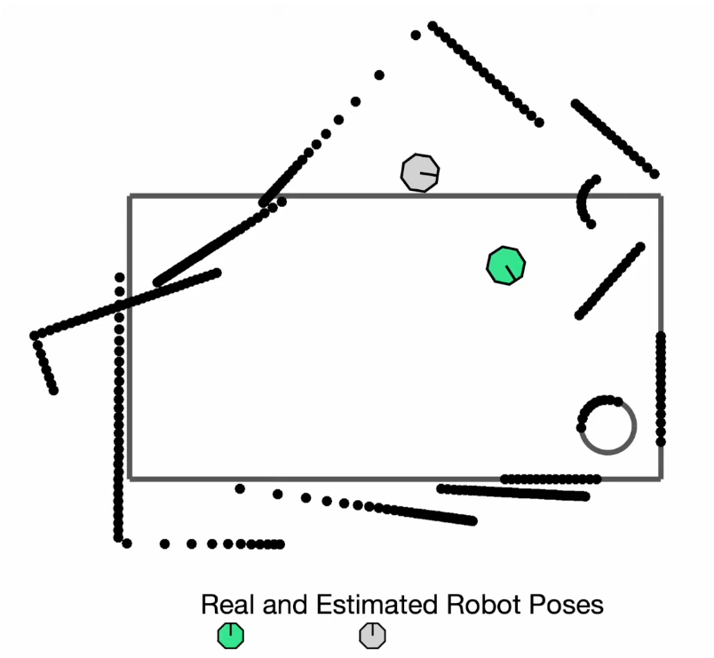

# Autonomous Vehicle Navigation

## Particle Filter (Known Map)
Monte-Carlo is used for determining the true pose of an autonomous vehicle, **given a map**.

### Particle Vs Kalman

1. Particle filter assumes no linearity in model and measurement models.
2. Particle filter can represent multi-modal distributions — multiple likely robot positions at once.
3. Particle filter can handle non-Gaussian noise.

However,
1. Kalman filter is faster.

### Steps of a Particle filter

**Step 1**: Generate a large number of discrete poses around the map. Uniformly randomize (x, y) and yaw.

**Step 2**: Lidar measurement returns. Using the map, each particle returns its own estimates of lidar reading. This is what the lidar would've have returned if that pose was the true pose.

**Step 3**: The filter then compares the two scenes - one given by actual lidar reading, the other given by each filter's estimate - and determines the likelihood of each particle being the true state. Updating the probability of each particle.

Note that after Step 3, the probability distribution is no longer uniform, but skewed towards the more probable poses.

**Step 4**: Resample based on the new probability distribution after the update.

**Step 5**: The vehicle dead-reckons its pose based on onboard odometry sensors (same as the prediction step in Kalman). Apply the same action to all particles. Since dead-reckoning is extremely **noisy**, when propagating the particles through the estimated dynamics, we add a process noise by injecting a random motion.

**Step 6**: As we are honing into the true pose, reduce the number of particles to speed up processing time. Adaptive Monte Carlo computes the new number of particles needed at each iteration.

**Step 7**: repeat the process until convergence is observed.

---

## SLAM (Unkown Map)
Simultaneously building a map and localizing.

### Main issue - uncertainty
Lidar is accurate by odometry would have large uncertainty which would make the map deviates more and more at each time step.

### Pose Graphs
A pose graph represents the positions and orientations (“poses”) of a vehicle or sensor over time as a graph structure.
- Nodes (vertices): Each node represents a pose — usually a 2D (x, y, θ) or 3D (x, y, z, roll, pitch, yaw) position and orientation estimate
- Edges: Each edge encodes a spatial constraint between two poses for both position and orientation, which comes from measurements (e.g., odometry, GNSS, LiDAR scan matching, visual odometry). These constraints often have associated uncertainty (covariance). Edges usually come from
    - Odometry / motion model (sequential poses)
    - **Loop closure detections** (non-sequential poses when the robot revisits a place)
    - Sensor measurements (e.g., odometry, GNSS, LiDAR scan matching, visual odometry)

### Solving the issue - Pose Graph Optimization and Loop closure
1. It is better to miss a loop closure than to add a false one. It's crucial that you're confident in the loop closure. 
2. Loop Closure requires an absolute measurement of the environment (lidar, camera, GNSS, etc). Relative measurements such as IMU or encoders cannot be used since there is no way to relate the readings back to a previous pose.
    - You may think you're close to a prior node with deadreckoning IMU and encoder, but cannot know for sure.

3. Optimization Problem
    - Objective (what we are optimizing): finding the set of robot poses $$\mathcal{X} = {x_1, x_2, ..., x_N}$$ that best explain all the measurements in the graph.
        - Each pose $$x_i$$ is usually a 2d vector $$(x, y, \theta)$$, or 3d $$(x, y, z, \phi, \theta, \psi)$$
    - For every edge between poses $$i$$ and $$j$$, we have a measured relative pose $$z_{ij}$$ and its uncertainty (covariance). $$z_{ij} = (\delta x, \delta y, \delta \theta)$

    - Cost Function:
        - for each edge:
            1. Predicted relative pose from current guess: $\hat{z}_{ij} - f(x_i, x_j)$. This is the geometric difference between current estimates of $$x_i$$ and $$x_j$$.
            2. Error (residual): $$e_{ij} = z_{ij} - \hat{z}_{ij}$$ 
            3. Weighting by confidence:
                - $$\||e_{ij}\||^{2}_{\Omega_{ij}} = e_{ij}^T * \Omega_{ij} * e_{ij} $$
                - where $$ \Omega_{ij} e_{ij} $$ is the information matrix (inverse of covariance).
                - If confidence in measurement is high, $$\Omega_{ij} e_{ij}$$ will be large.
                - If measurement is uncertain, $$\Omega_{ij} e_{ij}$$ will be small.
    - The full optimization problem

        We sum the weighted squared errors over **all edges** in the graph:

        $$
        \min_{\mathbf{X}} \; \sum_{(i,j) \in \mathcal{E}} e_{ij}^T \, \Omega_{ij} \, e_{ij}
        $$

        - **Variables**: the poses $$x_1, \dots, x_N$$  
        - **Measurements**: all $$z_{ij}$$  
        - **Goal**: adjust all poses so these relative constraints are satisfied **as much as possible**.

### Occupancy Grid (Mapping)
